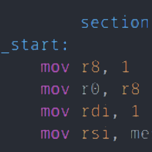
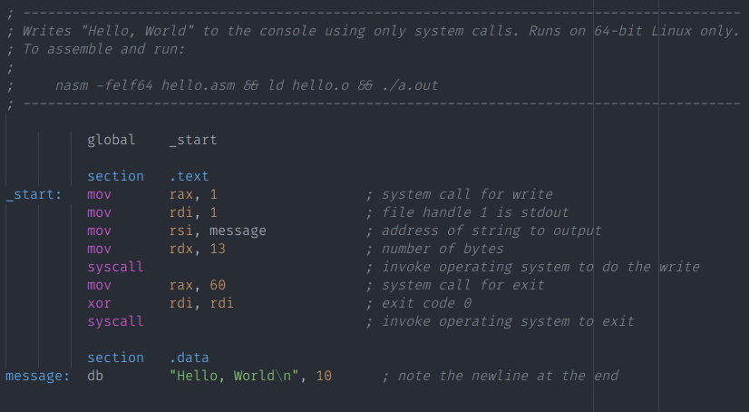
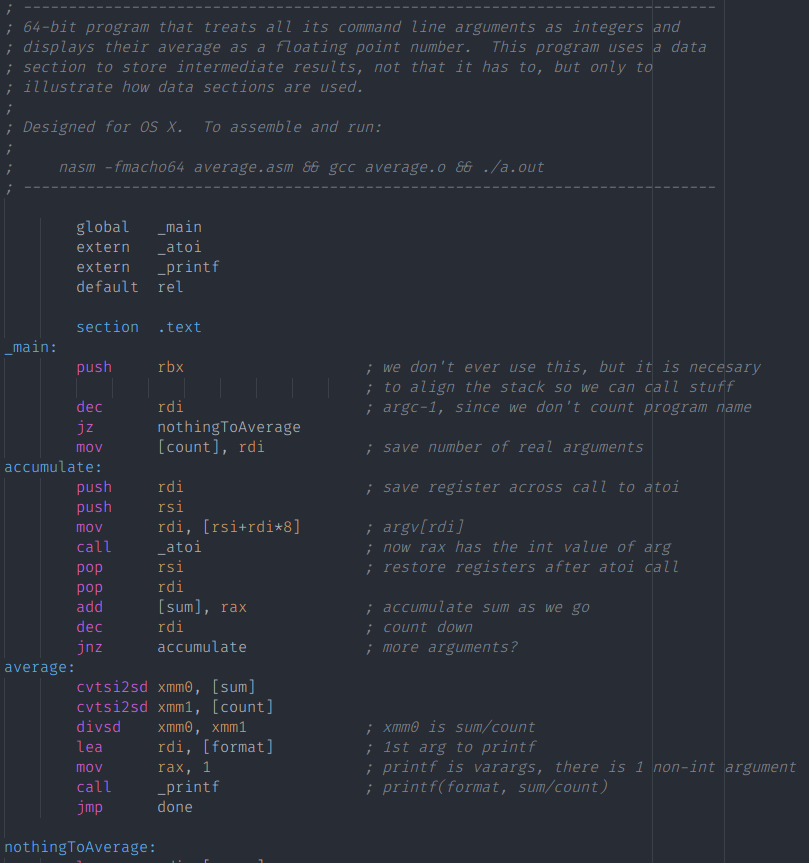

<p float="left">
<a href="../../"></a>
<a href="https://www.codacy.com/manual/FredHappyface/VSCode.x86_64Assembly"></a>
<a href="https://www.codacy.com/manual/FredHappyface/VSCode.x86_64Assembly"></a>
<a href="../../"></a>
<a href="../../issues"></a>
<a href="/LICENSE.md"></a>
<a href="../../commits/master"></a>
<a href="../../commits/master"></a>
</p>

# VSCode.x86_64Assembly



Taken from: https://github.com/13xforever/x86_64-assembly-vscode

## Modifications
- Registers case insensitive
- Highlights strings

## About
This is a TextMate/Sublime/VS Code/Atom bundle providing language support for x86_64 assembly language in a variety of dialects (nasm/yasm primarily, but could highlight tasm/gas to some extent).

## Features
- Basic support for NASM/YASM/TASM/GAS syntaxes
- Most up-to-date instruction sets:
	- Legacy/undocumented registers and instructions
	- FPU/MMX/3DNow!
	- SSE/SSE2/(S)SSE3/SSE4/SSE4.1/SSE4.2/SSE4.a
	- AVX/AVX2/AVX512, including pseudo-ops
	- AES-NI/SHA
	- VMX/SMX/NPX/SGX
	- other AMD/Cyrix/VIA and planned future Intel extensions

## Source code
VS Code package is exported from [Textmate/Sublime Bundle](https://github.com/13xforever/x86-assembly-textmate-bundle), all issues and pull requests should be filed there.

To compile the yaml sources to tmLanguage, you'll need [PackageDev](https://packagecontrol.io/packages/PackageDev).


## Download
### Clone
#### Using The Command Line
1. Press the Clone or download button in the top right
2. Copy the URL (link)
3. Open the command line and change directory to where you wish to
clone to
4. Type 'git clone' followed by URL in step 2
```bash
$ git clone https://github.com/FredHappyface/[repository]
```

More information can be found at
<https://help.github.com/en/articles/cloning-a-repository>

#### Using GitHub Desktop
1. Press the Clone or download button in the top right
2. Click open in desktop
3. Choose the path for where you want and click Clone

More information can be found at
<https://help.github.com/en/desktop/contributing-to-projects/cloning-a-repository-from-github-to-github-desktop>

### Download Zip File

1. Download this GitHub repository
2. Extract the zip archive
3. Copy/ move to the desired location


## Licence
MIT License
Copyright (c) 2019 Kieran W
Copyright (c) 2012-2015 Ilya Veselov (13xforever)
(See the [LICENSE](/LICENSE.md) for more information.)


## Screenshots

### Desktop
|Screenshots                                                                                  |
|:-:                                                                                          |
||
||
